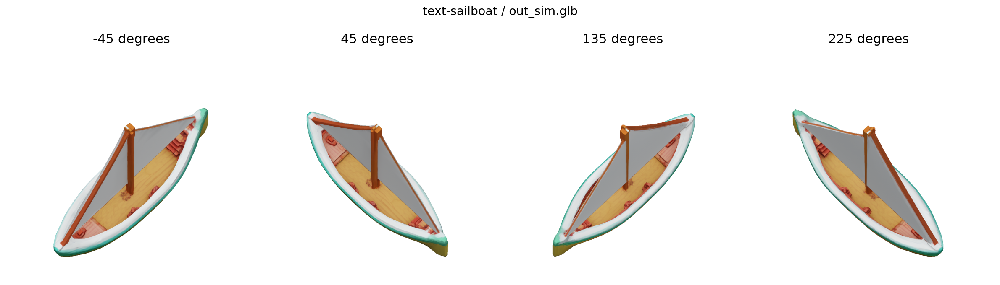

# Verification record

Verified on **2026-10-01**: fresh GPU and browser acceptance for **v0.1.0 passed**.
Generation used a clean committed checkout at
`c5bf333746853331e12aca30a10f1a0061d2fec5`.
[verification-results.json](verification-results.json) records hardware, model
revisions, coverage, geometry/texture checks, and every accepted GLB hash.

Later changes preserve comparison labels in replay metadata, publish these
records, and update the editor version to 0.1.0. Generation/runtime source,
generation configurations (apart from directory relocation), and NPZ/image bytes
were checked unchanged. The comparison figures were rendered again on CPU from
the accepted GLBs with the corrected control-color and appearance labels.

## Completed checks

| Check | Result and scope |
| --- | --- |
| CPU tests | **23 passed**, Python 3.12.14 on macOS and 3.10.19 on the workstation: HTTP save/history/reopen, replay preservation, numeric input checks, Blender diagnostics, appearance selection, model pins, checkpoint compatibility, and replay metadata. |
| Inputs | All **249 NPZ bundles in 83 cases** validated; all 83 replay configurations prepared. Original example files are unchanged from published MINIMAL. |
| Independent clone | Published RELEASE cloned into a separate directory with new Python and Node environments; CPU/example checks and UI tests/build repeated. |
| UI | **5 tests**, TypeScript check, and production Vite build passed with Node.js 24.19.0 and npm 11.6.4. A large JavaScript chunk warning remains. |
| Dependencies | Fresh runtime `pip check` passed; the UI advisory audit reported zero known vulnerabilities on the check date. |
| Fresh runtime | Python 3.10.19, PyTorch 2.8.0/cu128, CUDA toolkit 12.8.1, Blender 3.0.1, recorded dependency and model pins. |
| Native extensions | FlashAttention 2.8.3, Kaolin, torch-scatter, spconv, nvdiffrast, Gaussian rasterizer, and vox2seq imported; native builds passed with the recorded host adjustment below. |
| Text generation | Full **300-step** teacup, chair, and sailboat passed: successful status, nonempty finite geometry, UVs within [0,1], and 1024 by 1024 baked textures. |
| Image generation | Full **300-step** sailboat with the included historical preview as global image conditioning passed, using pinned offline TRELLIS/DINOv2/U2Net caches. |
| Comparisons | All **seven** retained teacup variants passed: local/global control, the copied local-routing result, raw TRELLIS, fixed-structure appearance FM, and fixed-structure GuideFlow appearance FM. Geometry and texture figures rendered successfully. |
| Browser | Chrome imported the teacup; edited a primitive name/scale and global/local prompts; saved and reopened inputs in a new session; started a real 300-step GPU generation; displayed its textured result. |
| Download | Final GLB downloaded through the UI; SHA256 matched the server file and local geometry/UV/texture checks passed. All **11 matrix GLBs**, including the copied variant, were also downloaded and validated. |
| GitHub CI | Three jobs passed at the generation commit: Linux/Python 3.10 and macOS/Python 3.12 CPU/example checks, plus UI tests/build. [Recorded run](https://github.com/joanlafuente/spaceflow/actions/runs/36832522991). [Current main checks](https://github.com/SpaceFlow3D/spaceflow/actions?query=branch%3Amain) record later publication commits. |

## Fresh generated assets

| Case | Vertices | Triangles | Texture |
| --- | ---: | ---: | --- |
| Text teacup | 6,753 | 11,106 | 1024 × 1024 |
| Text chair | 5,795 | 9,138 | 1024 × 1024 |
| Text sailboat | 6,227 | 8,112 | 1024 × 1024 |
| Image sailboat | 5,312 | 7,932 | 1024 × 1024 |
| Edited teacup through UI | 6,003 | 10,554 | 1024 × 1024 |

The matrix ran from **07:51:29 to 08:09:37 UTC**, about 18 minutes, on one
24 GB RTX 4090. A second 4090 handled browser generation concurrently. This is
an acceptance run, not an isolated benchmark. Whole-device memory sampling every
two seconds recorded **19,566 MiB (19.1 GiB)** peak usage. Smaller GPUs were not
verified. Model caches and the installed PartField copy used about 12 GiB;
dependencies, CUDA/Blender, download/build caches, and outputs require additional
work storage. The README's approximately 60 GiB budget includes these caches.

## Visual review and limits

Four-view renders of the three text assets and image-conditioned sailboat were
inspected, along with the comparison figures and actual browser-rendered GLB.
The chair and sailboat are recognizable and textured. The blue teacup retains its
pale handle and local color contrast, with a filled top, faceting, and visible
seams. The image-conditioned sailboat has a yellow/olive sail and dark spars;
exact color matching to the input image is not guaranteed.



These are research outputs. Only the recorded cases were generated freshly;
all 83 example inputs were validated and prepared. The standalone and comparison
teacup have different output hashes. Byte-identical or perceptually identical
reproduction is not claimed. Model revisions and actual file hashes are recorded.

No console errors were observed in the successful browser workflows. Three.js
emits a Clock deprecation warning. Earlier in-app browser download-event capture
timed out; download support there is not claimed. NPZ metadata preserves image
paths, not uploaded image bytes; reattach images after reopening.

## GPU access and first failed attempt

Student Cluster's authorized `dslab` / `dslab_jobs` tags were rejected as
unconfigured; no GPU job ran there. The user authorized pf-pc69 instead. Both
GPUs initially held unrelated Delimit3D training. The queue waited for an empty
GPU with at least 22 GiB free for 120 seconds and preserved existing jobs.

The first matrix at `3db81d04556279cf88e4c6358a3997be7ceca318` ran from 07:36
to 07:42 UTC and failed at PartField checkpoint loading. Raw TRELLIS produced a
valid textured GLB. The failed attempt and logs were preserved.

The recorded checkpoint contains `yacs.config.CfgNode`, which PyTorch 2.8's
weights-only loader does not allow by default. A scoped helper allows only that
configuration class while Lightning loads PartField. Weights-only loading stays
enabled; checkpoint weights and generation arithmetic are unchanged. Direct
loading and the repeated full suite passed. See
[PyTorch serialization](https://docs.pytorch.org/docs/2.8/notes/serialization.html#torch-load-with-weights-only-true).

### Debian 13 / CUDA 12.8 compatibility

pf-pc69 runs Debian 13, glibc 2.41, GCC 14.2.0, and NVIDIA driver 595.71.05.
CUDA 12.8's unmodified pi-math declarations conflict with the newer glibc
exception specifications. The first nvdiffrast build failed with that exact
error. The task-owned CUDA toolkit received the four-declaration `noexcept(true)`
adjustment described in the [NVIDIA compiler issue](https://forums.developer.nvidia.com/t/error-exception-specification-is-incompatible-for-cospi-sinpi-cospif-sinpif-with-glibc-2-41/323591).
The original header was backed up, and native builds then passed. No kernel
implementations or arithmetic were changed. This is an explicitly recorded
compatibility adjustment for this host, not a claim of upstream Debian 13 support.

The changed `crt/math_functions.h` hashes are:

- Original: `2f2189d1752d862e96122f985484c89e16bd03a485a01e1f114514f738a2ed4f`
- Adjusted: `024ff8406766f26573a1fe842cfb8e66f2ae35652fc0adc5e38b68a758276de9`

The task's private audit keeps the installer checksum, exact patch, before/after
hashes, compiler commands, installed-package list, cache marker, and environment
checks. For an unmodified toolkit, use a distribution supported by CUDA 12.8,
such as Ubuntu 22.04, following NVIDIA's installation guide.

The actual pipeline entrypoint check also exposed the missing `scikit-learn`
dependency. Its 1.7.2 pin and joblib/threadpoolctl pins were restored from the
recovered environment inventory. Preflight now imports that dependency and the
generation entrypoint as well as the native extensions.


## Repeat verification

From the repository root with the CPU editor environment activated:

```bash
python -m unittest discover -s tests -v
python tools/validate_examples.py
(cd sq_ui/app && npm test && npm run build)
python tools/verify_release.py --prepare-only --output-dir runs/release-prepared
```

Preparation creates five configurations without generation. The teacup retains
its saved 300 steps; acceptance copies of chair/sailboat set 300 and record that
change in `replay_provenance.json`. Original examples/defaults are preserved.
The image case uses the historical sailboat preview; choose another reference
with `--image-path /path/to/reference.png`.

On the GPU machine with a clean committed checkout, pinned runtime/models,
CUDA 12.8 and Blender configured, use a new output directory:

```bash
python tools/cache_models.py --cache-dir "$HF_HOME" --include-image
python tools/doctor.py --gpu --image
python tools/verify_release.py --output-dir runs/release-gpu
```

The suite records the commit, hardware, environment, packages, models, commands,
logs, and hashes. Text/image generation use staged offline caches. Its report
keeps browser generation/download and visual review as separate acceptance steps.
For Slurm, see [Research workflows](research.md) and `tools/verify_release.sbatch`.

The GitHub workflow targets Linux/Python 3.10, macOS/Python 3.12, and the UI build.
Initial OAuth/integration restrictions on workflow upload were resolved through
the existing signed-in GitHub web editor. MINIMAL and the older history remain
available. Changing the default branch requires repository administrator access.
Hugging Face deployment is deferred.

## Recovery lineage and earlier evidence

The original `MINIMAL` working tree was based on
`1d845ecdbcc4409b4ac82ffa6de8ccdf710626c5`. All 213 original tracked files were
restored and checked against preserved source hashes. Fourteen uncommitted edits
were retained in recovery commit `96b9cea` before the portability changes. The
original dirty worktree, inputs, metadata, and historical outputs were backed up
independently. Older Git history and `MINIMAL` remain recovery references; the
root README uses a shallow `RELEASE` clone to avoid downloading that large history.

Earlier checks on 2026-09-30 installed the pinned generation dependencies in a
fresh Linux Python 3.10.13 environment, passed `pip check`, and staged the recorded
TRELLIS/CLIP models and hash-matching PartField checkpoint. CUDA extensions and
fresh generation were not executed. Those earlier dependency/cache checks do not
verify the current release's GPU behavior.

Image-pipeline selection passed actual GPU conditioning in this suite. Generation
defaults, CLI flags, service endpoints, NPZ inputs, and model configurations remain
preserved. Historical outputs are separate artifacts. See
[third-party notices](../THIRD_PARTY_NOTICES.md) for upstream restrictions.
